<!-- hero: monochrome ASCII portrait (types in) beside the extruded 3d ascii
     wordmark (wipes in, then rocks on its vertical axis).
     portrait: python scripts/prep_photo.py <photo> && python scripts/make_ascii_svg.py
     wordmark: WORDMARK_TEXT=AMIR python scripts/make_wordmark_svg.py --mode rock
     wordmark build notes: docs/3d-ascii-wordmark.md -->

<h3><code>amir@github ~ $ whoami</code></h3>

<table>
<tr>
<td valign="top"></td>
<td valign="top"></td>
</tr>
</table>

Tech enthusiast &amp; intern into building and automation — comfortable in
Docker, GitHub Actions and Linux. Currently deep in backend, scripting, and
sharpening problem-solving. Always learning, always building.

 

<h3><code>amir@github ~ $ ./stack.sh</code></h3>

 

<h3><code>amir@github ~ $ ./projects.sh --featured</code></h3>

<b>VariOne</b> — a multi-tool pentesting/education device (ESP32) for teaching
wireless security in a controlled lab: WiFi scanning, packet monitoring,
sub-GHz RF, and an OLED mascot UI. Built for a cybersecurity graduation project.

 

<!-- animated contribution graph: real data, boxes reveal cell by cell
     (regenerated daily by .github/workflows/update-profile-art.yml) -->

<h3><code>amir@github ~ $ ./contributions.sh</code></h3>

 
 

<h3><code>amir@github ~ $ ./links.sh</code></h3>

 

